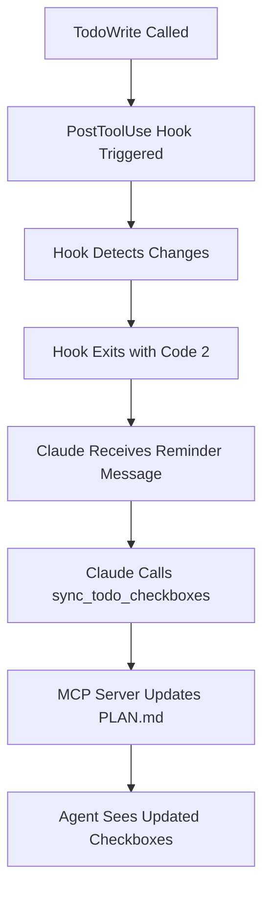

# TodoWrite Integration with Agent Communication MCP Server

## Overview

The **TodoWrite Integration** provides seamless synchronization between Claude Code's TodoWrite system and the Agent Communication MCP Server's PLAN.md checkboxes. This integration ensures consistency between task progress tracking in Claude Code and agent task visibility in the MCP server.

## Architecture

### Components

1. **TodoWrite PostToolUse Hook** (`.claude/hooks/sync-todos-to-checkboxes.py`)
   - Minimal Python script that detects TodoWrite changes
   - Exits with code 2 to signal Claude to take action
   - No direct MCP server interaction

2. **sync_todo_checkboxes MCP Tool** (`/src/tools/sync-todo-checkboxes.ts`)
   - Handles the actual synchronization logic
   - Maps TodoWrite statuses to checkbox states
   - Includes fuzzy matching and lock coordination

3. **Protocol Instructions** (TaskContextManager)
   - Injects TodoWrite integration instructions into agent context
   - Provides clear workflow guidance for agents

### Integration Flow



## Installation & Setup

### Prerequisites

- Claude Code with TodoWrite functionality
- Agent Communication MCP Server installed and configured
- Python 3.6+ for PostToolUse hooks

### Setup Steps

#### 1. Configure the PostToolUse Hook

Create or update `.claude/hooks/sync-todos-to-checkboxes.py`:

```python
#!/usr/bin/env python3
"""
Minimal TodoWrite PostToolUse hook
Reminds Claude to sync todos via agent-comm MCP
"""

import json
import sys

def main():
    """
    Parse TodoWrite result and remind to sync if needed
    Exit codes: 0 - No action needed, 2 - Reminder to sync
    """
    try:
        hook_data = json.loads(sys.stdin.read())
        
        # Check if TodoWrite with todos
        if hook_data.get('tool', {}).get('name') != 'TodoWrite':
            sys.exit(0)
        
        if hook_data.get('error'):
            sys.exit(0)
        
        todos = hook_data.get('result', {}).get('todos', [])
        if not todos:
            sys.exit(0)
        
        # Count states for context
        states = {'pending': 0, 'in_progress': 0, 'completed': 0}
        for todo in todos:
            if isinstance(todo, dict) and 'status' in todo:
                states[todo.get('status', 'pending')] += 1
        
        # Simple reminder
        total = sum(states.values())
        print(f"TodoWrite updated {total} todo{'s' if total != 1 else ''}: {states['completed']} completed, {states['in_progress']} in-progress, {states['pending']} pending.\n\nRemember to sync to your task checkboxes using the agent-comm MCP if you have an active task.")
        sys.exit(2)
        
    except Exception:
        sys.exit(0)  # Silent failure

if __name__ == '__main__':
    main()
```

#### 2. Configure Hook in Claude Settings

Update `.claude/settings.local.json`:

```json
{
  "hooks": {
    "PostToolUse": {
      "TodoWrite": {
        "command": "python",
        "args": [".claude/hooks/sync-todos-to-checkboxes.py"],
        "timeout": 10000
      }
    }
  }
}
```

#### 3. Configure MCP Server

Update your MCP configuration (e.g., `.mcp.json`):

```json
{
  "mcpServers": {
    "agent-comm": {
      "type": "stdio",
      "command": "node",
      "args": ["./node_modules/@jerfowler/agent-comm-mcp-server/dist/index.js"],
      "env": {
        "AGENT_COMM_DIR": "./comm",
        "AGENT_COMM_ARCHIVE_DIR": "./comm/.archive",
        "AGENT_COMM_DISABLE_ARCHIVE": "false"
      }
    }
  }
}
```

## Usage Guide

### Basic Workflow

#### 1. Start Task with TodoWrite

```python
# Get task context from MCP
context = mcp_call('get_task_context', agent='senior-frontend-engineer')

# Create todos based on requirements
TodoWrite([
    {"content": "Parse task requirements", "status": "in_progress", "activeForm": "Parsing requirements"},
    {"content": "Submit plan using submit_plan()", "status": "pending", "activeForm": "Submitting plan"},
    {"content": "Implement core functionality", "status": "pending", "activeForm": "Implementing"},
    {"content": "Report progress using report_progress()", "status": "pending", "activeForm": "Reporting progress"},
    {"content": "Mark complete using mark_complete()", "status": "pending", "activeForm": "Marking complete"}
])
```

#### 2. Hook Automatically Detects Changes

When TodoWrite is called, the PostToolUse hook automatically:
- Detects the tool call
- Counts todo states
- Displays reminder message
- Exits with code 2 to signal Claude

#### 3. Manual Sync to PLAN.md

Claude uses the sync_todo_checkboxes tool:

```python
mcp_call('sync_todo_checkboxes',
    agent='senior-frontend-engineer',
    todoUpdates=[
        {"title": "Parse task requirements", "status": "completed"},
        {"title": "Submit plan using submit_plan()", "status": "in_progress"},
        {"title": "Implement core functionality", "status": "pending"},
        {"title": "Report progress using report_progress()", "status": "pending"},
        {"title": "Mark complete using mark_complete()", "status": "pending"}
    ]
)
```

#### 4. Continue Task Progression

Update todos as work progresses and sync again:

```python
# Update todos
TodoWrite([
    {"content": "Parse task requirements", "status": "completed", "activeForm": "Requirements parsed"},
    {"content": "Submit plan using submit_plan()", "status": "completed", "activeForm": "Plan submitted"},
    {"content": "Implement core functionality", "status": "in_progress", "activeForm": "Implementing"},
    {"content": "Report progress using report_progress()", "status": "pending", "activeForm": "Reporting progress"},
    {"content": "Mark complete using mark_complete()", "status": "pending", "activeForm": "Marking complete"}
])

# Hook triggers again, Claude syncs again
mcp_call('sync_todo_checkboxes', agent='senior-frontend-engineer', todoUpdates=[...])
```

### Targeting Specific Tasks with taskId

By default, sync_todo_checkboxes updates the most recent task for an agent. When working with multiple tasks, you can target a specific task using the optional taskId parameter:

```python
# Auto-detect most recent task (default behavior)
mcp_call('sync_todo_checkboxes',
    agent='senior-frontend-engineer',
    todoUpdates=[
        {"title": "Parse requirements", "status": "completed"},
        {"title": "Implement features", "status": "in_progress"}
    ]
)

# Target specific task by ID
mcp_call('sync_todo_checkboxes',
    agent='senior-frontend-engineer', 
    taskId='implement-dashboard-20241205-143012',
    todoUpdates=[
        {"title": "Component setup", "status": "completed"},
        {"title": "API integration", "status": "in_progress"}
    ]
)
```

**When to use taskId:**
- Working with multiple concurrent tasks for the same agent
- Need to update an older task while newer tasks exist
- Ensuring updates go to a specific task when timing is critical
- Debugging or correcting checkboxes in archived tasks

### Checkbox State Mapping

The integration supports three checkbox states:

| TodoWrite Status | PLAN.md Checkbox | Description |
|------------------|------------------|-------------|
| `pending` | `[ ]` | Task not started |
| `in_progress` | `[~]` | Task currently being worked on |
| `completed` | `[x]` | Task finished |

### Fuzzy Matching

The sync tool uses fuzzy string matching (60% similarity threshold) to match TodoWrite titles with PLAN.md checkbox titles. This handles minor variations in wording:

**TodoWrite Title:** `"Submit plan using submit_plan()"`  
**PLAN.md Checkbox:** `"**Submit Implementation Plan**: Use submit_plan() tool"`  
**Result:** ✅ Matches (similarity > 60%)

## Technical Details

### Hook Implementation

The PostToolUse hook follows the **signal pattern**:

- **Responsibility**: Detect TodoWrite changes and notify
- **No Direct Action**: Doesn't call MCP server directly
- **Environment Separation**: Runs in Claude's process, not MCP server process
- **Exit Code 2**: Signals Claude to process the reminder message
- **Minimal Footprint**: ~40 lines of code for reliability

### MCP Tool Implementation

The sync_todo_checkboxes tool provides:

- **Fuzzy Matching**: 60% similarity threshold using Levenshtein distance
- **Lock Coordination**: 30-second timeout to prevent conflicts
- **Three-State Support**: Maps all TodoWrite statuses to appropriate checkboxes
- **Error Handling**: Graceful failure with detailed error messages
- **Atomic Operations**: All-or-nothing updates to maintain consistency

### Protocol Injection

Agent context automatically includes TodoWrite integration instructions:

```typescript
## TodoWrite Integration with MCP Tasks

**CRITICAL: Sync TodoWrite changes to PLAN.md checkboxes**
When you use TodoWrite to update todos, remember to sync these changes to your active task's PLAN.md checkboxes using the sync_todo_checkboxes tool.

**Integration Workflow:**
1. Update todos with TodoWrite (triggers hook reminder)
2. Use sync_todo_checkboxes tool to update PLAN.md
3. Continue with MCP task operations (report_progress, mark_complete)
```

## Error Handling

### Common Issues and Solutions

#### Hook Not Triggering

**Symptoms:** No reminder message after TodoWrite calls
**Causes:** 
- Hook file not executable
- Wrong file path in settings
- Python not in PATH

**Solutions:**
```bash
# Make hook executable
chmod +x .claude/hooks/sync-todos-to-checkboxes.py

# Verify Python path
which python3

# Test hook manually
echo '{"tool":{"name":"TodoWrite"},"result":{"todos":[{"status":"pending"}]}}' | python .claude/hooks/sync-todos-to-checkboxes.py
```

#### Sync Tool Errors

**Symptoms:** sync_todo_checkboxes fails with error
**Causes:**
- No active task found
- PLAN.md file doesn't exist
- Lock acquisition failure

**Solutions:**
```python
# Check for active tasks
tasks = mcp_call('check_tasks', agent='senior-frontend-engineer')

# Verify task context
context = mcp_call('get_task_context', agent='senior-frontend-engineer')

# Submit plan if missing
mcp_call('submit_plan', agent='senior-frontend-engineer', content='# Plan...')
```

#### Fuzzy Matching Failures

**Symptoms:** Checkboxes not updating despite sync calls
**Causes:**
- Title similarity below 60% threshold
- Special characters in titles
- Very different wording

**Solutions:**
- Use more similar titles between TodoWrite and PLAN.md
- Avoid special characters and symbols
- Keep titles focused on core action words

### Debugging

Enable detailed logging by checking MCP server logs:

```bash
# Check server logs (if logging enabled)
tail -f ./comm/.logs/agent-comm-mcp-server.log

# Test hook directly
echo '{"tool":{"name":"TodoWrite"},"result":{"todos":[{"content":"test","status":"pending"}]}}' | python .claude/hooks/sync-todos-to-checkboxes.py
```

## Best Practices

### TodoWrite Titles

- **Be Consistent**: Use similar wording between TodoWrite and PLAN.md
- **Be Specific**: Include key action words (submit, implement, analyze)
- **Be Concise**: Avoid overly long or complex titles
- **Include MCP Operations**: Explicitly mention MCP tools in todos

### PLAN.md Format

- **Use Bold Titles**: `**Title**: Description` format
- **Clear Actions**: Start with action verbs
- **Consistent Structure**: Follow same pattern throughout plan
- **Measurable Outcomes**: Include expected results

### Sync Frequency

- **After Every TodoWrite**: Always sync immediately after updating todos
- **Before MCP Operations**: Ensure checkboxes reflect current state
- **During Status Changes**: Sync when moving between pending/in_progress/completed
- **Never Batch**: Sync frequently rather than waiting

### Error Recovery

- **Monitor Hook Messages**: Pay attention to reminder frequency
- **Verify Sync Results**: Check PLAN.md after sync operations
- **Handle Failures Gracefully**: Don't let sync failures block task progress
- **Use Diagnostic Tools**: Leverage track_task_progress for monitoring

## Migration Guide

### From File-Based Communication

If migrating from file-based agent communication:

1. **Remove Old Hooks**: Delete any existing TodoWrite hooks that write files directly
2. **Update Configurations**: Switch to MCP-based configuration
3. **Test Integration**: Verify hook and sync tool work together
4. **Archive Old Data**: Use archive_tasks to clean up old communication files

### From Manual Sync

If currently syncing TodoWrite manually:

1. **Install Hook**: Add the PostToolUse hook for automatic detection
2. **Update Workflow**: Rely on hook reminders instead of manual checking
3. **Simplify Process**: Let the hook handle detection logic
4. **Maintain Consistency**: Continue using sync_todo_checkboxes tool

## Performance Considerations

### Hook Performance

- **Minimal Processing**: Hook does only essential checking
- **Fast Exit**: Exits quickly for non-TodoWrite tools
- **No I/O Operations**: No file reads or network calls
- **Exception Safety**: Fails silently to avoid disrupting Claude

### MCP Tool Performance

- **Lock Timeout**: 30-second maximum to prevent hanging
- **Fuzzy Matching**: Optimized algorithm for string similarity
- **Atomic Updates**: Single file write operation per sync
- **Efficient Parsing**: Minimal regex operations on PLAN.md

### Scale Considerations

- **Multiple Agents**: Each agent maintains separate task state
- **Concurrent Operations**: Lock coordination prevents conflicts
- **Large Plans**: Fuzzy matching scales linearly with checkbox count
- **Frequent Updates**: Hook and sync optimized for repeated calls

## Security Considerations

### Hook Security

- **No Network Access**: Hook runs locally with no external connections
- **Minimal Permissions**: Only needs to read stdin and write stdout
- **No Secrets**: No API keys or sensitive data required
- **Process Isolation**: Runs in separate process from Claude Code

### MCP Server Security

- **File System Access**: Limited to configured communication directory
- **No External APIs**: No outbound network requests
- **Input Validation**: All parameters validated before processing
- **Error Handling**: Sanitized error messages prevent information disclosure

This integration provides a robust, secure, and performant solution for maintaining consistency between TodoWrite and agent task management while preserving Claude Code's parallel execution capabilities.